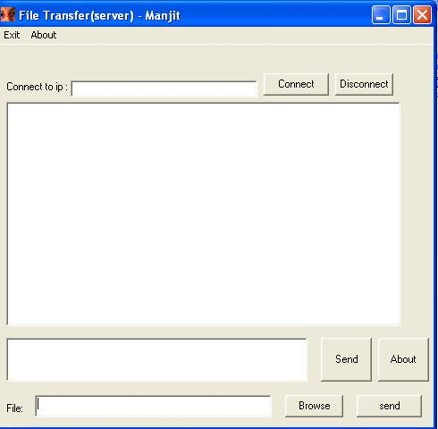



## \[ winsock file transfer tutorial \]

### Description

This tutorial is to explain how to send files (of any size) to any ip using winsock.I've assumed that the reader knows only the basics of winsock...so i've explained it in detail and the codes are higly commented...PLEASE VOTE FOR ME!!!
 
### More Info
 

             |
---                |---
**Submitted On**   |2005-03-24 18:33:56
**By**             |[Manjit Padhy](https://github.com/Planet-Source-Code/PSCIndex/blob/master/ByAuthor/manjit-padhy.md)
**Level**          |Intermediate
**User Rating**    |4.5 (204 globes from 45 users)
**Compatibility**  |VB 5\.0, VB 6\.0
**Category**       |[Complete Applications](https://github.com/Planet-Source-Code/PSCIndex/blob/master/ByCategory/complete-applications__1-27.md)
**World**          |[Visual Basic](https://github.com/Planet-Source-Code/PSCIndex/blob/master/ByWorld/visual-basic.md)
**Archive File**   |[\[\_winsock\_1868443262005\.zip](https://github.com/Planet-Source-Code/manjit-padhy-winsock-file-transfer-tutorial__1-59653/archive/master.zip)

### Source Code

This tutorial shows how to transfer file of any size using winsock control. 
 
open vb 
select standard exe 
 
press cntrl+t to show the add component window 
 
select winsock control and microsoft common dialog 
 
add one winsock control in the project--name it winsock1 
 
if you want to add chat then add another winsock and name it winsock2 
 
insert another winsock object if you want to add chat also 
 
add a microsoft common dialog box --- name it cd 
 
we will use this winsock1 object to transfer the file and winsock2 for chat 
 
 
 
The basic idea : 
To send a file of any size to any ip using winsock first we have to open the file in binary mode. 
then get chunks of data from it, chunk is a constant which is initialized to 8000, so we get 8000 
bytes of data each time and send it using winsock to the client. 
for example let "fname" be the string variable containg the file name then : 
 
 
 
Private Const chunk = 8000 
 
dim fname as string 'get the name of the file 
 
 
Open fname For Binary As #1 
Do While Not EOF(1) 
data = Input(chunk, #1) 
winsock1,sendata data 
DoEvents 
loop 
 
 
 
 
this will send 8000bytes of data from the file until the file ends. 
 
 
but before sending data from file to client we must send info about the file  
like..the name of the file...the extension...etc 
 
so when send is clicked first check wether a file is there i mean check wether something 
is typed in the text box and if yes check wether the file exists 
 
if both the above conditions are met then get the filename with the extension. 
send the file name to the client with "rqst" in front. 
for eg. if the name of file is "text.txt" then send "rqsttext.txt" to the client 
 
the client will then get the file name and display a msgbox with the name of the 
file and the user will be given a choice wether to accept the file or not 
if he\she selects yes then the client sends "okay" to the server and if he\she selects  
no then it sends "deny" to the server..this data i.e. "okay" or '"deny" arrivers on winsock1's 
local port the data is then checked using select case if its okay then "send" function 
is called with file address as an argument and send button and all buttons and text boxes 
associated with send file are disabled. 
If the response from client is "deny" then a msgbox is shown on server saying that the 
request to send the file .... as been denied..the user can send another request..or  
ask the client's user to accept the file using the chat module... 
 
 
 
this is called when send is clicked 
private sub send_click() 
 
'GET FILE NAME 
'using getfilename function to get the file name 
dim fnamea as string 
dim fname as string 
 
if text1.text = "" then 
msgbox "Please type the file name!!!", ,"Manjit" 
exit sub 
end if 
fname = text1.text 
'checking wether the file exists 
If Dir(fname) = "" Then 
MsgBox "File Does not exist Exists", ,"manjit" 
exit sub 'exiting sub it file does not exists 
end if 
 
fnamea=GetFileName(text1.text) 
fname=text2.text 
dim temp as string 
temp= "rqst" & fnamea 
 
'SEND 
 
winsock1.senddata temp 'sending file name of file 
 
end sub  
 
now the request is sent to the client 
then the server has to wait for the client's response 
 
this event is called when data arrives on winsock1 
 
Private Sub winsock1_dataarrival(ByVal bytestotal As Long) 
Dim response As String 
Winsock1.GetData response, vbString 
Select Case response 
Case "okay" 
send fname 'send function is called with file name as argument 
Case "deny" 
MsgBox "Your request to send the file " & fname & " has been denied", , "manjit" 'message when request is denied 
End Select 
End Sub 
 
The send function which actally sends the file 
 
 
Private Sub send(fname As String) 
Command2.Enabled = False 
Command3.Enabled = False 
Text1.Enabled = False 
 
Dim data As String 
Dim a As Long 
Dim data1 As String 
Dim data2 As String 
 
 
Open fname For Binary As #1 
 
Do While Not EOF(1) 
data = Input(chunk, #1) 
Winsock1.SendData data 
DoEvents 
Loop 
 
Winsock1.SendData "EnDf" 
Close #1 
Command2.Enabled = True 
Command3.Enabled = True 
Text1.Enabled = True 
 
End Sub 
 
 
'Other supporting functions:  
 
Function GetFileName(attach_str As String) As String 
 Dim s As Integer 
 Dim temp As String 
 s = InStr(1, attach_str, "\") 
 temp = attach_str 
 Do While s > 0 
  temp = Mid(temp, s + 1, Len(temp)) 
  s = InStr(1, temp, "\") 
 Loop 
 GetFileName = temp 
End Function 
 
 
 
On the client side :  
 
set winsock1 to listen to a particular port say : 165 
and winsoc2 if you want chat too :166 
 
 
winsock1 is listening to port 165 and winsock2 is listening to port 166 
on the client side 
 
 
so when connection request arrives : 
 
private sub winsock1_connectionrequest(byval idrequest as long) 
if winsock1.state <> sckConnected then 
winsock1.close 
winsock1.accept idrequest 
end if 
end sub 
 
and: 
 
private sub winsock2_connectionrequest(byval idrequest as long) 
if winsock2.state <> sckConnected then 
winsock2.close 
winsock2.accept idrequest 
end if 
end sub 
 
DATA ARRIVAL: 
 
and when data arrives 
 
 
 
 
Private Sub winsock1_dataarrival(ByVal bytestotal As Long) 
 
Dim data As String 
Dim data4 As String 
Dim data2 As String 
Dim data3 As String 
Dim data5 As String 
Dim data6 As String 
 
Winsock1.GetData data, vbString 
 
data2 = Left(data, 4) 
Select Case data2 
Case "rqst" 'file request arrives 
 
data3 = Right(data, Len(data) - (4)) 'Get the file name 
 
Dim msg1 As Integer 'Stores user's selection 
msg1 = MsgBox(Winsock1.RemoteHost & " wants to send you file " & data3 & " accept ? ", vbYesNo, "Manjit") 'msgbox displayed 
 
 
If msg1 = 6 Then 'if user selects yes 
Winsock1.SendData "okay" 
cd.FileName = data3 
data5 = Split(data3, ".")(1) 
data6 = "*." & data5 
cd.DefaultExt = "(data6)" 
data4 = App.Path & "\" & data3 
'MsgBox data5 
'cd.ShowSave 
 
Open data4 For Binary As #1 
 
Else 
Winsock1.SendData "deny" 
Exit Sub 
End If 
 
Case "EnDf" 
Label1.Caption = "File revieved.Size of file : " & sz & " Kb" 
size=0 
sz=o 
Close #1 
Case Else 
 
size = size + 1 
Label1.Caption = size * 8 & "Kb Recieved" 
sz = size * 8 
Put #1, , data 
End Select 
End Sub 
 
This will take care of file transfer now for the chat: 
we will be using winsock2 for chat: 
 
On server side : 
 
WHEN SEND IS CLICKED 
 
Private Sub Command1_Click() 
Dim chat As String 
chat = Text1.Text 
List1.AddItem (chat) 
Winsock2.SendData chat 
 
End Sub 
 
when data arrives : 
 
Private Sub winsock2_dataarrival(ByVal bytestotal As Long) 
Dim cht As String 
Winsock2.GetData cht, vbString 
List1.AddItem (cht) 
 
End Sub 
 
 
the same will be on the client side also...if you want a better chat client then visit 
my tutorial on planet source code.com : 
 
http://www.planet-source-code.com/vb/scripts/ShowCode.asp?txtCodeId=59417&lngWId=1 
 
or mail for the tutorial... 
 
I've included a copy of this tutorial in the zip file(tutorial.txt) 
 
Hope you liked it!!!..PLEASE RATE ME!!!!!!!!! 
 
 
 

